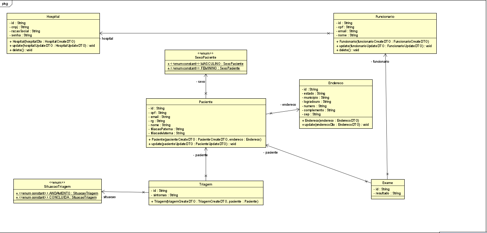
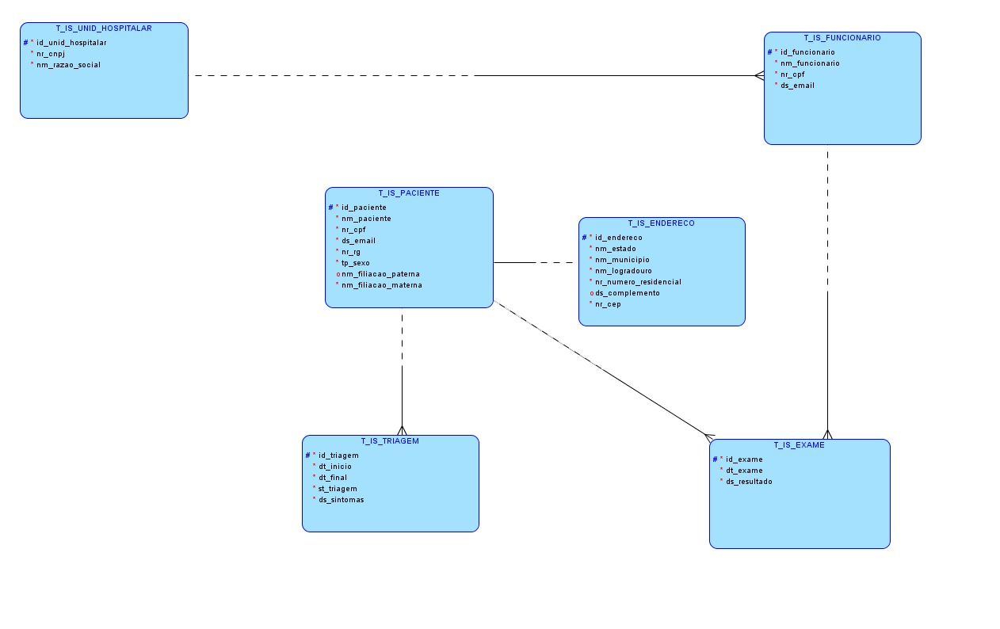

# Projeto InScreening - Documentação

O projeto proposto visa criar uma plataforma para triagem hospitalar. Inicialmente, o paciente confirma suas informações e escolhe um hospital da plataforma. Em seguida, ele reporta seus sintomas, 
podendo escolher opções predefinidas. Pacientes com sintomas sugestivos de COVID-19 ou pneumonia são encaminhados para exames de raio-x. O exame é conduzido por profissionais de saúde designados pelo hospital, 
com as imagens sendo analisadas por um modelo de IA em busca de sinais das doenças. Caso uma dessas doenças seja identificada, o paciente é classificado como prioridade alta, garantindo um atendimento mais rápido
<br>
### Apresentação dos Integrantes
#### Mastering Relational and Non-Relational Database - Leonardo Bruno de Sousa
#### Disruptive Architectures: IoT, IoB & Generative AI - Samara de Oliveira Moreira
#### Mobile Application Development - Vinícius Andrade Lopes
#### DevOps Tools & Cloud Computing - Vinicius Monteiro Manfrin
#### Advanced Business Development with .NET - Marco Antônio de Araújo
#### Java Advanced - Vinicius Monteiro Manfrin
#### Compliance, Quality Assurance & Tests - Samara de Oliveira Moreira
<br>

## Tecnologias Utilizadas

- Java 17
- Spring Boot
- Oracle DataBase
- Bean Validation (para validações de formulários)
- Spring Data JPA
- Lombok
<br>

## Configuração da Aplicação

Para rodar a aplicação corretamente, siga os passos abaixo:

1. *Requisitos de Sistema*:
   - Certifique-se de ter o Java 17 instalado em sua máquina.
   - Garanta que o Oracle DataBase esteja instalado e em execução.

2. *Configurações no arquivo application.properties*:
   - Abra o arquivo src/main/resources/application.properties.
   - Configure as seguintes propriedades relacionadas ao banco de dados:
     
```
spring.datasource.url=jdbc:oracle:thin:@oracle.fiap.com.br:1521:ORCL
spring.datasource.username=${ORACLE_DB_USERNAME:}
spring.datasource.password=${ORACLE_DB_PASSWORD:}
spring.datasource.driver-class-name=oracle.jdbc.OracleDriver
spring.jpa.hibernate.ddl-auto=update
```

3. *Execução da Aplicação*:
   - Após configurar todas as propriedades necessárias, execute a aplicação.
   - A aplicação será iniciada em http://localhost:8080.

<br/>

## Pitch
https://youtu.be/DcmOWfKmNeE?si=fHOiejlcN7wZ_M55

## Diagrama de Classes de Entidade


## Diagrama de Relacionamento 


## Cronograma de desenvolvimento
[Trello](https://trello.com/b/t2BoeW1w/inscreening)

## Requisições dos endpoints
[Insominia](src/main/java/com/vinimanfrin/inscreening/documentacao/RequisiçõesInScreening_Insomnia)

## Mais detalhes
Após inicializar o projeto , consulte /swagger-ui/index.html para informações mais detalhadas dos endpoints.

## Endpoints

### Hospital

`GET` /hospital

   Retorna uma lista de todos os hospitais.
   
**Códigos de status**

`200` Sucesso

---

`GET` /hospital/{id}

   Retorna os detalhes de um hospital com o ID fornecido.
   

**Códigos de status**

`200` Sucesso

`404` Id não encontrado

---

`POST` /hospital

   Cria um novo hospital no sistema.
   
   **Corpo da requisição**
   
   ```json
   {
       "cnpj": "61282055000126",
       "razaoSocial": "teste",
       "senha": "123456"
   }
   ```

**Códigos de status**

`201` Sucesso

`400` Validação falhou

---

`PUT` /hospital/{id}

Atualiza os detalhes do hospital com o ID fornecido.

**Códigos de status**

`200` Sucesso

`400` Validação falhou

`404` Id não encontrado

---


`DELETE` /hospital/{id}

Exclui logicamente o hospital com o ID fornecido do sistema.

**Códigos de status**

`204` Sucesso

`404` Id não encontrado

---

### Funcionário

`GET`/funcionario

   Retorna uma lista de todos os funcionários.
   

**Códigos de status**

`200` Sucesso

---

`GET`/funcionario/{id}

   Retorna os detalhes de um funcionário com o ID fornecido.
   

**Códigos de status**

`200` Sucesso

`404` Id não encontrado

---

`POST`/funcionario

   Cria um novo funcionário no sistema.
   
   **Corpo da requisição**
   
   ```json
   {
       "cpf": "17633539070",
       "email": "teste3@gmail.com",
       "nome": "Funcionario Teste3",
       "idHospital": "6a1f32af-3c91-49ae-bea0-7ace2a813251"
   }
  ```

**Códigos de status**

`200` Sucesso

`400` Validação falhou

---

`PUT`/funcionario/{id}

Atualiza os detalhes do funcionário com o ID fornecido.

**Códigos de status**

`200` Sucesso

`400` Validação falhou

`404` Id não encontrado

---


`DELETE`/funcionario/{id}

Exclui logicamente o funcionário com o ID fornecido do sistema.

**Códigos de status**

`200` Sucesso

`404` Id não encontrado

---
<br>

### Paciente

`GET`/paciente

   Retorna uma lista de todos os pacientes.
   
**Códigos de status**

`200` Sucesso

---

`GET`/paciente/{id}

   Retorna os detalhes de um paciente com o ID fornecido.
   
**Códigos de status**

`200` Sucesso

`404` Id não encontrado

---

`POST`/paciente

   Cria um novo paciente no sistema.
   
   **Corpo da requisição**
   
   ```json
   {
       "cpf": "53298760013",
       "email": "emailteste3@gmail.com",
       "rg": "1111111113",
       "sexo": "MASCULINO",
       "endereco": {
           "estado": "sp",
           "municipio": "sp",
           "logradouro": "lins",
           "numero": "122",
           "cep": "04330060"
       },
       "nome": "paciente teste",
       "filiacaoPaterna": "pai do teste",
       "filiacaoMaterna": "mae do teste"
   }
  ```

**Códigos de status**

`201` Criado com sucesso

`400` Validação falhou

---
`PUT`/paciente/{id}

Atualiza os detalhes do paciente com o ID fornecido.

**Códigos de status**

`200` Sucesso

`400` Validação falhou

`404` Id não encontrado

---
### Triagem

`GET` /triagem

   Retorna uma lista de todas as triagens realizadas.
   
**Códigos de status**

`200` Sucesso

---

`GET` /triagem/{id}

   Retorna os detalhes de uma triagem com o ID fornecido.

**Códigos de status**

`200` Sucesso

`404` Id não encontrado

---

`POST`/triagem

   Cria uma nova triagem no sistema.
   
   **Corpo da requisição**
   
   ```json
   {
       "idPaciente": "a97eb6c1-a1af-47b0-ae91-264aa024e68d",
       "sintomas": [
           "FEBRE",
           "FALTA_DE_AR",
           "DOR_NO_PEITO",
           "TOSSE"
       ]
   }
  ```

**Códigos de status**

`201` Criado com sucesso

`400` Validação falhou

---
